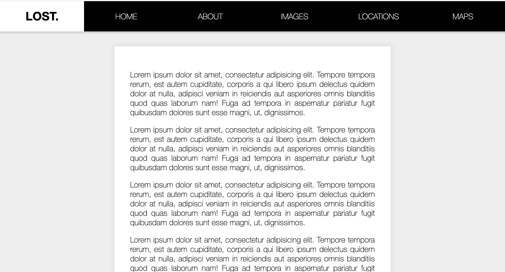

# Sticky Nav

Day 24 of Javascript30 by WesBos. Made a site which has a sticky nav. It was a good way to practice scroll coordinates and offset heights.

# Demo

# Technologies Used

HTML5, CSS, Vanilla JS

# Website

https://buigabor.github.io/sticky-nav/
